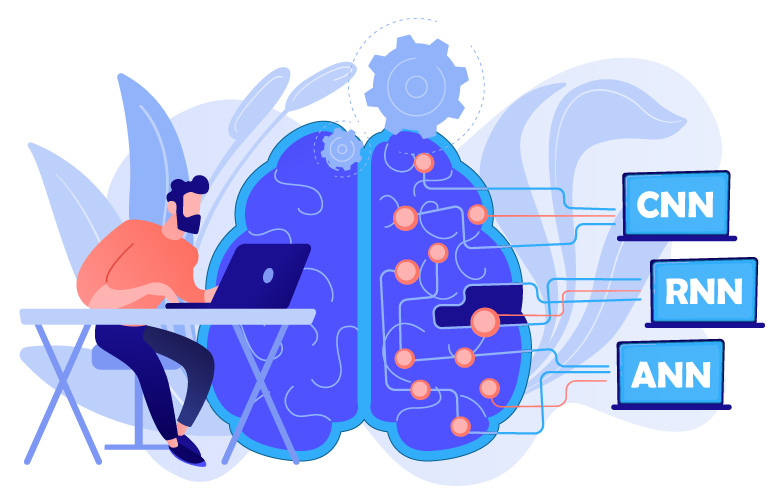

# Problem Analysis for AI/ML

In this section, we will guide you through the process of analyzing real-life problems and identifying suitable AI/ML approaches. The goal is to develop a structured framework for addressing problems using AI and Machine Learning techniques.

## Step-by-Step Framework

To effectively approach AI/ML problem-solving, follow this step-by-step framework:

### 1. **Problem Definition**

- **Understand the problem**: Start by defining the problem clearly. Break it down into smaller components and identify key objectives.
- **Example**: A self-driving car system needs to detect pedestrians and other vehicles in real-time to make driving decisions.

  

### 2. **Data Collection**

- **Identify available data**: Data is crucial for training AI/ML models. Identify the data that is relevant to the problem and assess its quality.
- **Data Sources**: Collect data from sensors, cameras, historical data, or public datasets.
- **Example**: For the self-driving car, you need data from cameras, LIDAR, and radar sensors to detect objects around the vehicle.

  

### 3. **Data Preprocessing**

- **Clean and transform data**: Raw data is often noisy and unstructured. Clean, preprocess, and structure the data for analysis.
- **Data Augmentation**: In cases of limited data, apply augmentation techniques to improve model robustness.
- **Example**: For object detection, images may need resizing, normalization, or annotation of objects in the scene.

  

### 4. **Feature Engineering**

- **Identify important features**: Analyze the data to find patterns, and select relevant features that help in model prediction.
- **Dimensionality reduction**: In some cases, reducing the number of features (e.g., using PCA) might improve performance.
- **Example**: For the car detection system, features such as object shape, size, and speed could be useful in distinguishing between pedestrians, cars, and other obstacles.

  

### 5. **Model Selection**

- **Choose an AI/ML approach**: Based on the problem type (supervised, unsupervised, reinforcement learning), select the most appropriate algorithm.
  - **Supervised learning**: For classification or regression tasks.
  - **Unsupervised learning**: For clustering or anomaly detection.
  - **Reinforcement learning**: For decision-making problems with feedback loops.
- **Example**: For pedestrian detection, a **Convolutional Neural Network (CNN)** would be suitable, as it excels in image processing tasks.

  

### 6. **Model Training**

- **Split data**: Divide data into training, validation, and test sets to prevent overfitting.
- **Model tuning**: Adjust hyperparameters to optimize the model's performance.
- **Example**: Train a CNN on labeled images of pedestrians and cars, fine-tuning hyperparameters such as learning rate, batch size, and the number of layers.

  

### 7. **Evaluation and Validation**

- **Assess model performance**: Use metrics such as accuracy, precision, recall, and F1-score for classification tasks, or RMSE for regression tasks.
- **Cross-validation**: Implement k-fold cross-validation to ensure your model generalizes well to new data.
- **Example**: Test the pedestrian detection system on a separate test dataset and calculate the model's accuracy in correctly identifying pedestrians.

  

### 8. **Deployment and Monitoring**

- **Deploy the model**: Once validated, deploy the model into a production environment (e.g., cloud, edge devices).
- **Continuous monitoring**: Monitor the model's performance in real-world scenarios to detect drift or inaccuracies over time.
- **Example**: Deploy the trained pedestrian detection model to a self-driving car system and monitor its performance in real-time.

  

## Case Study: Self-Driving Car Object Detection

### Problem Definition

A self-driving car needs to detect pedestrians, other vehicles, and obstacles in its path to make safe driving decisions.

### Data Collection

- Data sources: Cameras, LIDAR, and radar sensors on the car.
- Data includes images of roads, pedestrians, and vehicles in various conditions.

### Data Preprocessing

- Images are resized, normalized, and annotated with bounding boxes around objects.
- Augmentation techniques like rotation and scaling are applied to increase dataset diversity.

### Feature Engineering

- Features include object location, size, and motion. Edge detection and object segmentation are also useful features.

### Model Selection

- Choose a **Convolutional Neural Network (CNN)**, as it is effective for image recognition tasks.
- Consider advanced models like **YOLO (You Only Look Once)** or **Faster R-CNN** for real-time object detection.

### Model Training

- The model is trained on a labeled dataset with images of pedestrians, cars, and obstacles.
- Hyperparameters such as the learning rate and batch size are tuned using a validation set.

### Evaluation

- Evaluate using metrics such as accuracy and Intersection over Union (IoU) for bounding box predictions.
- The model is validated using cross-validation to ensure robustness.

### Deployment and Monitoring

- The trained model is deployed to the car's onboard computer for real-time object detection.
- Continuous monitoring of its performance ensures safety in dynamic driving conditions.

## Conclusion

By following this structured approach, participants will gain the skills to analyze real-life problems and identify suitable AI/ML approaches for problem-solving. Through a combination of problem definition, data handling, model training, and deployment, participants will be equipped to solve complex real-world challenges using AI and Machine Learning techniques.
