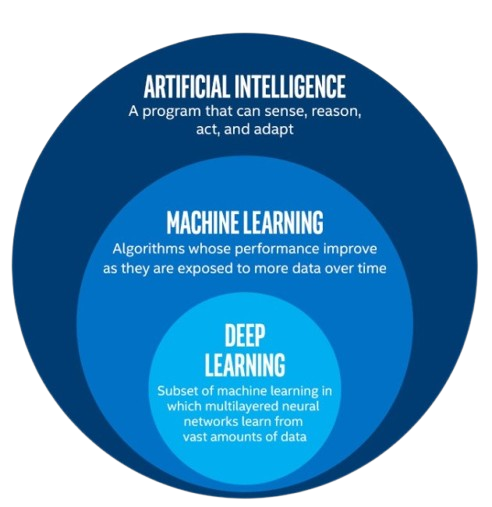
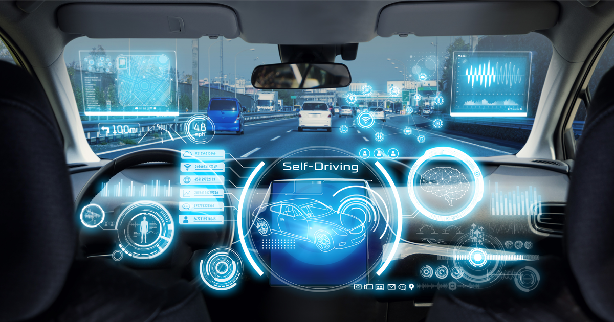
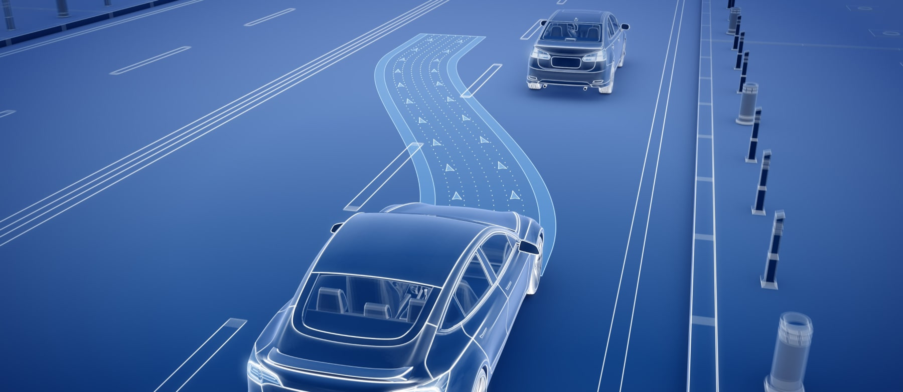
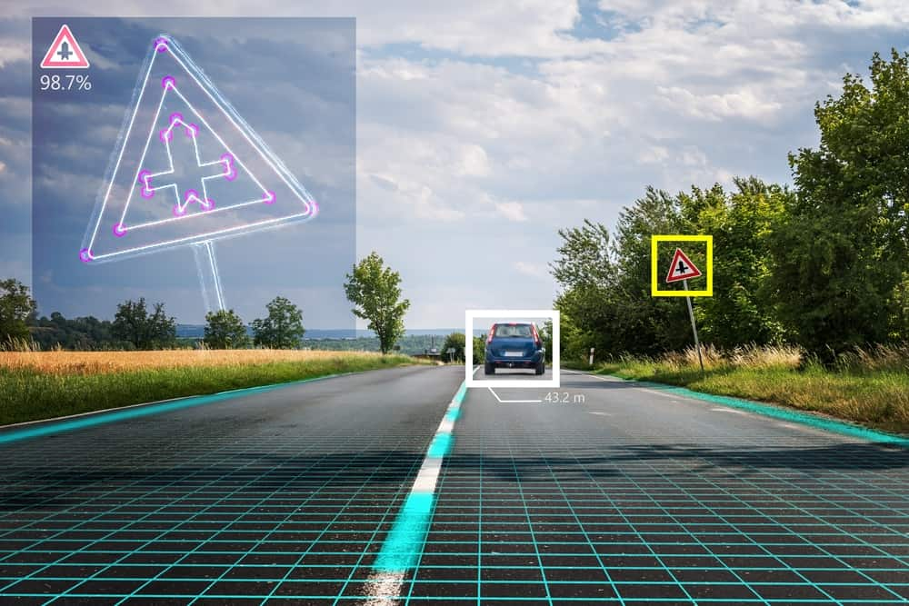
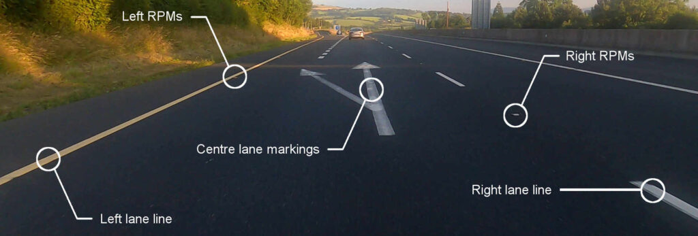

# Introduction: AI vs. ML vs. DL

In this section, let's briefly explore the distinctions between **Artificial Intelligence (AI)**, **Machine Learning (ML)**, and **Deep Learning (DL)** with some real-world examples to make the concepts clear.

## What is Artificial Intelligence (AI)?

AI is the broadest term, referring to the simulation of human intelligence by machines. It involves enabling systems to perform tasks typically requiring human intelligence, such as decision-making, problem-solving, and understanding language.

- **Example**: Virtual assistants like Siri and Alexa are examples of AI systems that use natural language processing to understand and respond to queries.

  

## What is Machine Learning (ML)?

ML is a subset of AI that focuses on systems learning from data to improve performance over time, without being explicitly programmed. Algorithms identify patterns and make predictions or decisions based on the data provided.

- **Example**: Spam email filters in your inbox that adapt and improve at identifying unwanted emails.

  

## What is Deep Learning (DL)?

DL is a subset of ML that uses artificial neural networks with multiple layers (hence "deep") to model and understand complex patterns in large datasets. It is particularly effective for tasks like image recognition and natural language processing.

- **Example**: Facial recognition systems, such as those used in smartphones to unlock the screen.

  

## AI, ML and DL as Subsets of Each Other

  

---

### Summary Table

| **Aspect**          | **AI**                               | **ML**                               | **DL**                               |
|----------------------|--------------------------------------|--------------------------------------|--------------------------------------|
| **Definition**       | Simulation of human intelligence    | Machines learning from data          | Learning through deep neural networks |
| **Complexity**       | Broad                               | More specific                        | Highly specialized                    |
| **Example**          | Virtual assistants                 | Spam filters                         | Facial recognition                    |

By understanding these distinctions, you'll gain clarity on how these fields intersect and differ, preparing you for the workshop activities ahead.

---

## AI, ML, and DL: Autonomous Driving

Autonomous driving is a real-world application where we can clearly separate **AI**, **ML**, and **DL** within different aspects of the system. Let’s explore how each contributes to making self-driving cars a reality.

  

---

## Artificial Intelligence (AI): Decision-Making and Planning

AI oversees the entire system, ensuring the car makes intelligent decisions based on its environment.

- **Role**: The AI system combines all components—traffic rules, sensor data, route planning, and human-like behavior—to simulate driving intelligence.
- **Example**: Deciding when to slow down, overtake another vehicle, or take a detour due to road construction.

  

---

## Machine Learning (ML): Predicting and Analyzing Patterns

ML algorithms handle specific tasks by learning from data to improve performance over time.

- **Role**: ML predicts patterns such as the behavior of other vehicles, pedestrians, or changes in traffic conditions.
- **Example**: Identifying stop signs or predicting when a pedestrian might cross the road based on historical data.

### How ML Works

1. **Training**: Algorithms like Decision Trees or Random Forests learn from labeled data (e.g., "This is a stop sign").
2. **Prediction**: When encountering new situations, ML applies learned patterns to make decisions.

  

---

## Deep Learning (DL): Processing Raw Sensor and Visual Data

DL takes on the most challenging tasks by analyzing raw, unstructured data such as images and sensor readings.

- **Role**: DL models like Convolutional Neural Networks (CNNs) process camera feeds, while Recurrent Neural Networks (RNNs) analyze sequential sensor data.
- **Example**: Detecting lane markings, identifying objects (like cars and traffic lights), and interpreting traffic signs.

### Why DL is Essential

1. **Unstructured Data**: Handles raw data directly from cameras, LiDAR, and radar.
2. **Complex Feature Extraction**: Learns to identify subtle features like faded lane markings or partially obscured traffic signs.

  

---

## Table: Autonomous Driving

| **Aspect**               | **AI**                                           | **ML**                                          | **DL**                                           |
|--------------------------|--------------------------------------------------|------------------------------------------------|-------------------------------------------------|
| **Scope**                | High-level decision-making                       | Learning from structured data                  | Analyzing raw and unstructured data             |
| **Role in Driving**      | Route planning, traffic management               | Predicting vehicle or pedestrian behavior      | Object detection, lane recognition              |
| **Example**              | Deciding to slow down at an intersection         | Predicting a car's trajectory in adjacent lanes| Identifying other cars from camera feeds        |
| **Strengths**            | Broad integration of tasks                      | Adapts to patterns in structured data          | High accuracy with image and sensor processing  |

---

## Summary

Autonomous driving illustrates how **AI**, **ML**, and **DL** work together in harmony:

- AI acts as the brain, orchestrating the system.
- ML provides adaptability by learning from data.
- DL powers perception, enabling the car to "see" and interpret its surroundings.

By breaking down this scenario, it becomes easier to understand how these technologies complement each other in building a cohesive and intelligent system.

---

## Conclusion: AI vs. ML vs. DL

AI, ML, and DL are interrelated fields, each contributing uniquely to the development of intelligent systems:

- **AI** is the overarching domain focused on mimicking human intelligence in machines, covering a broad spectrum of techniques and applications.
- **ML** is a subset of AI that enables systems to learn from data and improve performance without being explicitly programmed.
- **DL** is a specialized branch of ML, leveraging deep neural networks to process and understand complex data like images, audio, and text.

While AI provides the conceptual framework, ML brings adaptability and data-driven decision-making, and DL offers powerful tools for handling unstructured data and solving highly complex tasks. Together, they form a hierarchical structure where each layer builds on the other to create cutting-edge technologies that shape our world today.

Understanding their differences and synergies helps in choosing the right approach for specific challenges, ensuring more effective and efficient solutions.
